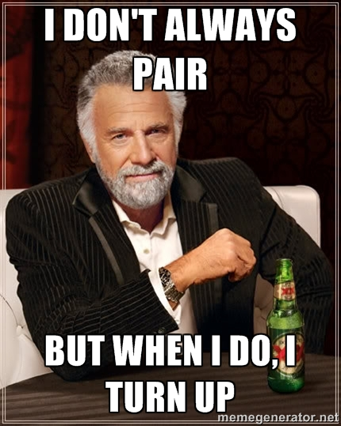

# Turn up
## A fun way to commit as a pair

by Macklin Underdown / @macklinu
---
# I :heart: pairing
---
# Pairing is :poop:
---
# ¯\\\_(ツ)\_/¯
---
# :information_desk_person: :speech_balloon:

> Whether you love or hate pairing, we can all agree that attributing work to both pair partners is a pain.

> -- [How To Create GitHub Avatars For Pairs](https://robots.thoughtbot.com/how-to-create-github-avatars-for-pairs)
---

---
## turn up

> To let loose and have fun.

> -- [UrbanDictionary](http://www.urbandictionary.com/define.php?term=Turn+Up&defid=7045357)

---
# :bulb:

[Thoughtbot's pairing article](https://robots.thoughtbot.com/how-to-create-github-avatars-for-pairs)

+

the desire to make a command line app in Ruby

=
---
<section data-background="images/pairing-places.gif">
    <h2><span style="background-color: #FFFF00;">Turn</span></h2>
    <h3><span style="background-color: #FFFF00;">Commit as a pair in the most exciting way possible.™</span></h3>
</section>
---
# Driver

```yaml
:name:   Macklin Underdown
:github: macklinu
:email:  macklin@email.com
```

---
# Navigator

```yaml
:name:   David Klawitter
:github: davidklaw
:email:  dave@email.com
```

---
# Pair

```yaml
:name:   <driver full name> + <navigator full name>
:email:  <driver>+<navigator>@email.com
```

---
# Pair

```yaml
:name:   Macklin Underdown + David Klawitter
:email:  macklin+dave@email.com
```

---
# Get started

Create a `.pairs.yaml` file at the root of your Git repository

```yaml
:pairs:
  -
    :name:   Macklin Underdown
    :github: macklinu
    :email:  macklin@email.com
  -
    :name:   David Klawitter
    :github: davidklaw
    :email:  dave@email.com
```
---
# Become one

Try out [PhotoFunia's Face Swap](https://photofunia.com/effects/face_swap) web app


---
# Configure Gravatar

__macklin+andrew.giang@email.com__


---
## Now you can turn up

```bash
# start pairing
$ turn up --with davidklaw
$ turn up -w davidklaw
```

## Or turn down

```bash
# stop pairing
$ turn down
$ turn down --for-what
```
---
# Under the hood

Determine the driver from global git config properties

```bash
$ git config --global --get $PROPERTY
```

Re-commit as a pair in `.git/hooks/post-commit`

```bash
$ git commit --amend --author=$AUTHOR_STRING --no-edit
```

---
## :octocat:

[__macklinu/turn__](https://github.com/macklinu/turn)


